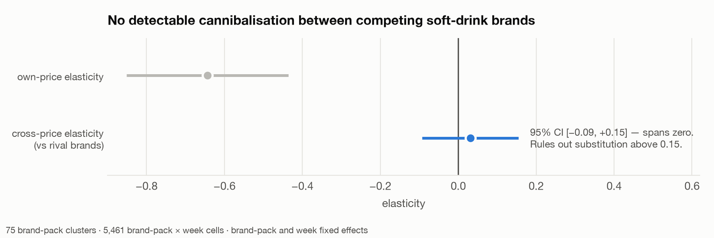

# Promo Efficiency and Price Elasticity — dunnhumby Complete Journey

Own-price elasticity, cannibalisation, and promo incrementality for **carbonated soft
drinks** across 2 years of real grocery transaction data (2,500 households, 2.6M
transactions, 36.8M product × store × week promo records).

**The finding:** naive elasticity from observational retail data is wrong in *two
directions at once*, and both errors recommend the same thing — promote more.

---

## Headline

| | Naive | Controlled | |
|---|---|---|---|
| Own-price elasticity | −0.334 *(p = 0.09, n.s.)* | **−0.571** *(p < 0.001)* | 1.7× understated |
| Display lift | +290% | **+70%** | 4.1× overstated |

A generic notebook stops at "no measurable price response in soft drinks." That
conclusion is an artefact of pooling across brands and pack formats.


Standard errors clustered on brand-pack. The ladder is the deliverable — each rung
strips one source of confounding, and the movement between rungs *is* the result.

**The ladder is not monotone.** On synthetic data with a known elasticity, adding
product fixed effects *alone* made the estimate 71% worse than no controls at all
(`tests/test_recovery.py`). "I added controls until the number stabilised" is not a
defensible method.

---

## The four questions

### 1. Own-price elasticity → −0.571, inelastic

|e| < 1 means the volume response does not pay for the price cut. Soft drinks is a
margin giveaway at current mechanics.

### 2. Cannibalisation → **null**, and tightly measured



Cross-price elasticity **+0.031**, 95% CI **[−0.093, +0.154]** across 75 brand-pack
clusters. This does not merely fail to find substitution — it **rules out
substitution above 0.15**. Consistent with carbonated soft drinks being the textbook
high-brand-loyalty category.

### 3. So where does the lift come from? → **pantry loading**

If promotion doesn't steal from rivals and the category is inelastic, the volume has
to come from somewhere. It comes from the household's own future.

| Effect of buying on promo *(household + week FE, n = 63,970 trips)* | |
|---|---|
| Units bought on that trip | **+42.4%** |
| Days until next purchase | **+5.7%** |
| Net purchase rate | **+34.7%** *(CI +31.4%, +38.0%)* |

**14% of the extra volume is given back** as a longer gap before the next purchase.
Incrementality is haircut by that much everywhere downstream.

### 4. Baseline vs incremental → and the call

Two independent counterfactuals — a gradient-boosted baseline trained only on
non-promo weeks (validated R² = 0.862 on held-out non-promo cells) and the
fixed-effects model run backwards — agree at **r = 0.989**.


---

## The recommendation

**Stop `display + mailer`.**

| | |
|---|---|
| Discount absorbed | **$73,110** — 87% of all promo spend |
| Volume given up | **34,057 units** — 21% of category volume |
| Break-even gross margin | **105%** *(125% under the FE counterfactual)* |
| Net gain at a 25% gross margin | **$55,740** |

The break-even margin is **above 100%**, which is the whole argument: the mechanic
spends $73,110 of discount to generate roughly $69,000 of incremental *revenue*. It
loses money at any gross margin whatsoever. Complete Journey has no cost-of-goods
field, so margin had to be assumed — solving for break-even instead makes the call
independent of that assumption.

The reason is discount depth, not a weak response. The combo mechanic runs at
**40.4% off shelf** ($3.47 → $2.07, $1.40 of discount per unit). Even though 76% of its
promoted volume is genuinely incremental, a 40% giveaway applied to *every* unit —
including the 24% that would have sold anyway — costs $1.04 for each $1 of incremental
revenue it buys. Before margin enters the picture at all.

**Reprice rather than promote.** With elasticity at −0.571, a 5% shelf-price increase
gives up roughly 2.9% of volume and holds 2.1% more revenue — a better trade than
buying volume at $1.04 of discount per $1 of incremental revenue.

---

## What I got wrong

Kept in, because the corrections are the point.

**The first panel grain was broken.** Built at product × store × week as planned, then
found **71.4% of cells contained exactly one unit** — `log(units)` was zero for most
of the panel and estimates swung between −0.06 and −0.44 on trivial filter changes.
2,500 households cannot support SKU × store × week. Rebuilding at brand-pack × week
(mean 26 units/cell) is what made the estimate stable.

**A bug in my own reporting.** `cannibalization.py` printed "SUBSTITUTES" whenever the
point estimate was positive, ignoring significance — it said so off `+0.026` with
`p = 0.78`. It now reports the interval and refuses to call direction when the CI spans
zero.

**A control that didn't bind.** Built a fixed-weight geometric price index to remove
unit-value mix bias. It correlates 0.989 with plain unit value and moved the
coefficient from −0.334 to −0.317. Real, small, reported anyway.

**`ABS()` on the discount field.** Discounts are stored negative, but 36 rows carry a
small positive value. `ABS()` would have flipped those into phantom discounts;
`GREATEST(-x, 0)` floors them.

## Limitations

- **No cost-of-goods in the dataset.** Margin conclusions are framed as break-even
  thresholds rather than point estimates.
- **The mechanic-level split is the weakest result.** The two counterfactuals agree at
  r = 0.989 in aggregate but disagree 61% on display-only. Aggregate incrementality is
  solid; per-mechanic ranking is directional.
- **Baseline MAPE is 46%** at cell level despite R² = 0.862 in logs. Fine summed across
  1,275 cells, not for any single-cell claim.
- **Identification is selection-on-observables**, not causal. Brand-pack and week fixed
  effects absorb the promo calendar and seasonality; they do not handle unobserved
  competitor pricing, stockouts, or endogenous assortment.
- **Treat −0.571 as this chain's response on a 2,500-household panel**, not a universal
  soft-drinks elasticity. The *gap between specs* is the robust finding; the absolute
  level is the softer claim.

---

## Reproduce

```bash
python3 -m venv .venv && ./.venv/bin/pip install -r requirements.txt
# unzip dunnhumby Complete Journey CSVs into data/raw/
./.venv/bin/python src/load.py            # 8 CSVs -> DuckDB (2.6s)
./.venv/bin/python src/screen.py          # rank categories on fitness for the study
./.venv/bin/python src/elasticity_brandpack.py
./.venv/bin/python src/cannibalization.py
./.venv/bin/python src/pantry_loading.py
./.venv/bin/python src/incremental.py
./.venv/bin/python src/recommendation.py
./.venv/bin/python src/figures.py
./.venv/bin/python tests/test_recovery.py # does the spec recover a planted elasticity?
```

| File | Purpose |
|---|---|
| `sql/01_panel.sql` | product × store × week panel, price reconstruction, promo flags |
| `sql/02_category_screen.sql` | ranks commodities on within-store-week promo variation |
| `sql/03_brandpack_panel.sql` | brand-pack × week panel with fixed-weight price index |
| `src/elasticity_brandpack.py` | the five-rung ladder |
| `src/cannibalization.py` | cross-price elasticity + event decomposition |
| `src/pantry_loading.py` | household-level purchase acceleration |
| `src/incremental.py` | GBM and FE counterfactuals, incremental per discount dollar |
| `src/recommendation.py` | break-even margin and volume give-up |
| `tests/test_recovery.py` | recovers a planted elasticity from confounded synthetic data |
| `tests/test_parity.py` | asserts DuckDB and BigQuery agree on the built panels |
| `src/port_to_bigquery.py` | transpiles the DuckDB SQL to BigQuery, qualifying real tables |
| `src/bigquery_run.py` | loads to BigQuery and runs the panel build there |
| `sql/bigquery/*.sql` | generated — do not edit; regenerate from `sql/` |

### Running it on BigQuery

The analysis SQL is authored once against DuckDB (fast local iteration, no cloud bill)
and **mechanically transpiled** to BigQuery standard SQL, so the two can never drift.
`port_to_bigquery.py` qualifies real tables with the target dataset and leaves CTE
references bare; the output round-trips as valid BigQuery.

```bash
./.venv/bin/python src/port_to_bigquery.py --dataset my-proj.promo_rgm
gcloud auth application-default login
./.venv/bin/python src/bigquery_run.py --dataset my-proj.promo_rgm --dry-run   # validate, costs nothing
./.venv/bin/python src/bigquery_run.py --dataset my-proj.promo_rgm --load      # load 8 CSVs
./.venv/bin/python src/bigquery_run.py --dataset my-proj.promo_rgm             # build the panels
```

Fits inside the free tier: loads are free, ~850MB against 10GB free storage, and the
full panel build **billed 1.646 GB — 0.16% of the 1TB monthly free allowance**.
`--dry-run` validates statements against the live service without running them, and
defers any file that reads a table the chain itself creates.

**Verified, not assumed.** A transpile that parses is not a transpile that is correct:
`ANY_VALUE(x IGNORE NULLS)` parsed cleanly and BigQuery rejected it at runtime, and a
dialect difference in `LN`/`EXP` would have shifted the price index without erroring at
all. `tests/test_parity.py` asserts the two engines return identical numbers:

```
panel_all rows         duckdb=  2,350,004      bigquery=  2,350,004
brandpack cells        duckdb=      6,502      bigquery=      6,502
brand-packs >=30wk     duckdb=         81      bigquery=         81
soft drinks units      duckdb=    161,035      bigquery=    161,035
total sales value      duckdb= 328,532.92      bigquery= 328,532.92
mean price_index       duckdb=     2.5651      bigquery=     2.5651
```

Data: [dunnhumby Complete Journey](https://www.dunnhumby.com/source-files/). Stack:
DuckDB, pyfixest, scikit-learn, pandas, matplotlib.
