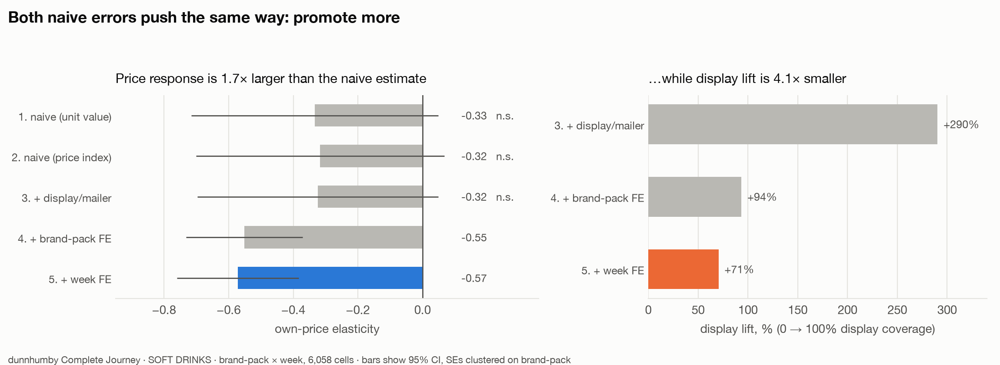
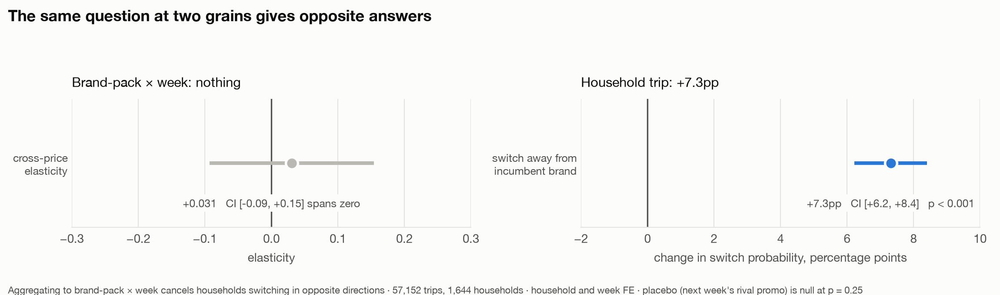
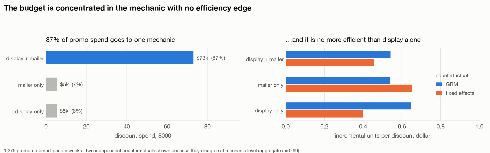

# Promo Efficiency and Price Elasticity — dunnhumby Complete Journey

Own-price elasticity, cannibalisation, and promo incrementality for **carbonated soft
drinks** across 2 years of real grocery transaction data (2,500 households, 2.6M
transactions, 36.8M product × store × week promo records).

**Two findings.** Naive elasticity from observational retail data is wrong in *two
directions at once*, and both errors recommend the same thing — promote more. And the
cannibalisation question returns opposite answers depending on the grain it is asked
at: a tight null in aggregate, a large effect at household level. The aggregate null
was the wrong test, not a result.

---

## Headline

| | Naive | Controlled | |
|---|---|---|---|
| Own-price elasticity | −0.334 *(p = 0.09, n.s.)* | **−0.571** *(p < 0.001)* | 1.7× understated |
| Display lift | +290% | **+70%** | 4.1× overstated |

A generic notebook stops at "no measurable price response in soft drinks." That
conclusion is an artefact of pooling across brands and pack formats.



Standard errors clustered on brand-pack. The ladder is the deliverable — each rung
strips one source of confounding, and the movement between rungs *is* the result.

**The ladder is not monotone.** On synthetic data with a known elasticity, adding
product fixed effects *alone* made the estimate 71% worse than no controls at all
(`tests/test_recovery.py`). "I added controls until the number stabilised" is not a
defensible method.

---

## Where −0.571 sits against published work, and why

Trade and academic estimates for carbonated soft drinks typically land near −0.8 to
−1.0 at category level and −1.5 to −3.5 at brand level. **−0.571 is materially weaker
than both.** That gap is not a footnote, so here is the accounting for it rather than
a disclaimer.

**Two biases run in opposite directions in this design.** Naming only the one that
flatters the result would be dishonest.

**Attenuating (pushes toward zero, and dominates here).** The panel is brand-pack ×
week, so a cell blends promoted and non-promoted stores and days into one average
price. Week fixed effects then absorb the chain-wide promo calendar, which is where
most of the price variation actually lives. What survives to identify the coefficient
is within-week, cross-brand-pack price movement, a much thinner signal than the raw
price swings a brand-level study would exploit. Classical measurement error in a
regressor attenuates its coefficient, and aggregation is measurement error.

**Inflating (pushes the magnitude up).** Price is reconstructed as sales value over
units, so units appears on both sides. Any error in the units count moves the
constructed price the other way mechanically, and the regression reads that as demand
response. This is division bias, and it is *not* what the fixed-weight geometric index
addresses. That index removes within-cell mix drift, which is why it correlates 0.989
with plain unit value and only moved the coefficient from −0.334 to −0.317. It was
built for the wrong problem, honestly reported as such below.

**Net position.** Attenuation is the larger of the two, so **−0.571 is best read as a
lower bound on the true magnitude for this chain**, not as evidence that soft drinks
are unusually insensitive. Every downstream conclusion here is directionally safe
under that reading: a *stronger* true elasticity makes discounting look worse, not
better, and makes the reprice argument stronger.

**What would fix the inflating side.** Instrument the price. The standard choice on
this data is the same brand-pack's price in *other* stores in the same week, or the
lagged shelf price, both of which correlate with the local cost and calendar shock but
not with this cell's unit-count error. Not implemented, and named as the first thing I
would build next.

---

## The four questions

### 1. Own-price elasticity → −0.571, inelastic as measured

|e| < 1 means the volume response does not pay for the price cut. Read with the
lower-bound caveat above: the point estimate says inelastic, and the direction of the
dominant bias means the true value could cross −1. The promo conclusions below survive
either way, because they turn on discount depth and incremental share, not on the
elasticity level.

### 2. Cannibalisation → **the grain decides the answer**



At brand-pack × week, cross-price elasticity is **+0.031**, 95% CI **[−0.093, +0.154]**
across 75 clusters. That is not a weak null — it rules out substitution above 0.15. The
obvious reading is that carbonated soft drinks are a high-loyalty category where
promotion does not move share.

**Asked at household level instead, the answer reverses:**

| Rival brand promoted in that store-week *(57,152 trips, 1,644 households)* | |
|---|---|
| *(base rate is switching when no rival is promoted, 35.6%; the unconditional rate across all trips is 41.8%)* | |
|---|---|
| Switch away from incumbent brand | **+7.3pp** (CI +6.2, +8.4; p < 0.001) |
| …off a base switch rate of | 35.6% — a **20% relative increase** |
| Incumbent brand promoted instead | **−11.6pp** — own promotion defends the base |

Survives household FE, week FE and store FE.

**Placebo — next week's rival promotion cannot cause this week's switch.** Promo is
autocorrelated week to week, so the lead is significant *on its own*; reporting only
that would misread as a failed placebo. The test is whether it survives beside the real
treatment:

| Specification | Lead coefficient | p |
|---|---|---|
| Lead alone | +0.0136 | 0.006 |
| Lead **and** contemporaneous treatment | **+0.0055** | **0.257** |

The lead collapses; the real treatment holds at +0.0722 (p < 0.001).

#### These two results conflict. They do not merely differ in power.

It would be convenient to say household switching "cancels out" in aggregate. It does
not — a *net* +7.3pp move away from the incumbent is a net volume loss, and it should
appear in aggregate volumes. Converting one estimate into the other's units
(`src/reconcile_grains.py`):

| | |
|---|---|
| Incumbent retention, rival not promoted → promoted | 0.644 → 0.571, so Δln q = −0.121 |
| Mean discount depth in promoted weeks | 36.3%, so Δln p = −0.452 |
| **Implied cross-price elasticity** | **+0.267** |
| Aggregate estimate | +0.031, CI [−0.093, **+0.154**] |

The implied value is **1.7× the upper bound of the aggregate confidence interval**. The
specifications disagree.

*One caveat on that arithmetic:* the household treatment is "rival on display or
mailer," which bundles merchandising with the price cut, so +0.267 is an upper bound on
the pure price channel. Even discounted for that, the intervals do not meet.

**What actually explains it: the pooled spec fits one coefficient across brand pairs
that do not share one.** Estimated separately per sub-commodity:

```
SOFT DRNK SNGL SRV BTL CARB   +3.270      SOFT DRINK BOTTLE NON-CARB   -0.994
SOFT DRINKS 6PK/4PK CAN       +3.210      SFT DRNK MLT-PK BTL CARB     -0.482
SOFT DRINKS 12/18&15PK CAN    +2.076      SOFT DRINKS 20PK&24PK CAN    -0.082
TEA SWEETENED                 +0.936      SFT DRNK 2 LITER BTL         +0.175
                                          pooled estimate              +0.031
```

Individually these are noisy — few clusters each — and none should be quoted alone. The
point is the **spread**: −0.99 to +3.27. A single pooled coefficient across that is not
an average of the parts, because pooling weights by within-cell variance rather than
equally. Week fixed effects compound it by absorbing the chain-wide promo calendar,
which is where most rival price variation lives.

**Resolved in favour of the household grain**, for three reasons: it measures the
behaviour directly rather than inferring it from volume, it does not require pooling
heterogeneous pairs, and it passes a placebo the aggregate spec has no equivalent of. A
tight null is seductive — it reads as a finding rather than a failure. Both results stay
in the repo because the conflict, and its resolution, is the point.

### 3. So where does the lift come from? → **pantry loading**

Rival theft is one source of promoted volume. The other is the household's own future
— the same shopper buying sooner and bigger, then staying away longer.

| Effect of buying on promo *(household + week FE, n = 63,970 trips)* | |
|---|---|
| Units bought on that trip | **+42.4%** |
| Days until next purchase | **+5.7%** |
| Net purchase rate | **+34.7%** *(CI +31.4%, +38.0%)* |

**14% of the extra volume is given back** as a longer gap before the next purchase.

**This is the least well identified result in the project, and the confidence
intervals oversell it.** Household and week fixed effects absorb the fact that some
households are habitually heavy buyers and that some weeks are promo-heavy. They do
not absorb *within-household selection into the promo trip itself*: a household that
already intended a stock-up is more likely to time that trip to a promotion. That is
simultaneity, and it inflates both the basket-size effect and the interpurchase gap in
the same direction the story predicts. The CIs above are sampling error only, so they
are narrow around a number that may be biased.

The qualitative claim — that promotion pulls volume forward from the same household —
now stands on this result alone. It was originally propped up by the cannibalisation
null, on the logic that if the volume was not stolen it had to be borrowed. The
household switching result removes that leg: volume *is* being stolen, so forward-buying
is one of two mechanisms rather than the residual explanation. **Treat +42.4% and the
14% giveback as an upper bound on forward-buying, not a point estimate.** A
cleaner design would compare the same household's promo and non-promo trips
conditional on days-since-last-purchase, or use household promo exposure driven by
store-level calendar rather than by the household's own trip timing.

### 4. Baseline vs incremental → and the call

Two independent counterfactuals — a gradient-boosted baseline trained only on
non-promo weeks (validated R² = 0.862 on held-out non-promo cells) and the
fixed-effects model run backwards — agree at **r = 0.989**.



---

## How the sample narrows

The counts change between sections because each analysis needs a different minimum.
The cascade, in one place:

| Stage | Unit | n | Filter applied |
|---|---|---|---|
| Raw panel | product × store × week | 2,350,004 | none |
| Brand-pack panel | brand-pack × week | 6,502 | aggregated to brand-pack grain |
| Elasticity sample | brand-pack | 81 | ≥ 30 weeks observed |
| Cannibalisation sample | brand-pack cluster | 75 | ≥ 30 weeks *and* a within-category rival present |
| Incrementality cells | brand-pack × week | 1,275 | promoted cells only, inside the 81 |
| Pantry loading | household trip | 63,970 | trips with a category purchase and an observable next trip |
| Brand switching | household trip | 57,152 | as above, with a previous trip inside 60 days and a top-4 manufacturer |

---

## The recommendation

**Cut the depth on `display + mailer`. Do not run it at 40% off.**

The mechanic absorbs 87% of promo spend, so "stop it" is not an instruction any
commercial team can act on in a quarter. The failure is the depth, not the mechanic,
and the depth is a dial.

| | |
|---|---|
| Discount absorbed | **$73,110** — 87% of all promo spend |
| Volume given up *(cutting depth to 16.3%)* | **9,172 units — 5.7% of category** at the measured elasticity; 14,985 (9.3%) if the true elasticity is −1.0 |
| *(for comparison, stopping the mechanic outright)* | *34,057 units — 21.1% of category* |
| Current depth | **40.4% off shelf** ($3.47 → $2.07, $1.40/unit) |
| Incremental share of promoted volume | **76%** |
| Break-even gross margin *at current depth* | **105%** *(125% under the FE counterfactual)* |
| **Break-even depth at a 25% gross margin** | **16.3%** *(19% before the pantry haircut)* |
| **Run at** | **2.5× break-even depth** |

**Why break-even margin above 100% is the argument.** At current depth the mechanic
spends $73,110 of discount to generate roughly $69,000 of incremental *revenue*. It
loses money at any gross margin whatsoever, before cost of goods enters the picture.
Complete Journey has no cost-of-goods field, so margin had to be assumed; solving for
break-even instead makes the call independent of that assumption.

**Why depth is the lever.** A 40% giveaway applies to *every* unit, including the 24%
that would have sold anyway. That is what costs $1.04 for each $1 of incremental
revenue. With incremental share `s` and gross margin `m`, promo gross profit clears
baseline when

```
depth ≤ m × s
```

which at m = 25% and s = 76% puts break-even at 19% off, and at **16.3%** once the 14%
pantry giveback is netted out of `s`. The haircut-adjusted figure is the one quoted
throughout: 40.4% ÷ 16.3% = **2.5× break-even depth**.

*And `s` here is too generous.* Incremental share is measured at **brand** level, so a
unit taken from a rival on the same shelf counts as incremental. For the retailer it is
not — the same case of soda sold, with a discount paid to move it. Section 2 puts rival
switching at +7.3pp, so retailer-level `s` sits below 76% and break-even depth below
19%: at `s` = 60% it is 15%, at `s` = 50% it is 12.5%. Every value in that range leaves
the mechanic run at more than twice its break-even depth, which is why the call does not
turn on pinning `s` down exactly.

*Assumption, stated:* this holds incremental share fixed as depth falls, which it will
not be exactly — shallower discounts usually convert a smaller share of volume. It is
a first-order bound, and the gap between 40% and 19% is wide enough that the direction
survives a reasonable amount of slippage. Testing depth response properly needs
variation in depth within mechanic, which this panel has too little of.

**And reprice alongside.** With elasticity at −0.571, a 5% shelf-price increase gives
up roughly 2.9% of volume and holds 2.1% more revenue. If the true elasticity is
stronger than the measured lower bound, that trade weakens, so this is the softer of
the two recommendations. The depth cut does not depend on the elasticity level at all.

---

## What I got wrong

Kept in, because the corrections are the point.

**The first panel grain was broken.** Built at product × store × week as planned, then
found **71.4% of cells contained exactly one unit** — `log(units)` was zero for most
of the panel and estimates swung between −0.06 and −0.44 on trivial filter changes.
2,500 households cannot support SKU × store × week. Rebuilding at brand-pack × week
(mean 26 units/cell) is what made the estimate stable. The cost of that fix is the
attenuation documented above; it was the right trade, not a free one.

**I ran the cannibalisation test at the wrong grain, and the null was convincing.**
Brand-pack × week returned a tight, well-powered null with a CI that ruled out
substitution above 0.15, and I wrote it up as evidence of brand loyalty. It took asking
*"is this the grain the behaviour happens at?"* to find a +7.3pp effect the aggregate
spec had averaged away across heterogeneous brand pairs. My first write-up then made it
worse: I claimed the two results reconciled because opposite-direction switching
"cancels" in aggregate. That is wrong — a net effect does not cancel — and it papered
over a genuine specification conflict. The section now converts one estimate into the
other's units and shows they do not overlap. The lesson is not that aggregate tests are
bad; it is that a precise null is not self-validating, and that asserting a
reconciliation is not the same as demonstrating one.

**A bug in my own reporting.** `cannibalization.py` printed "SUBSTITUTES" whenever the
point estimate was positive, ignoring significance — it said so off `+0.026` with
`p = 0.78`. It now reports the interval and refuses to call direction when the CI spans
zero.

**A control that didn't bind, and didn't address what I thought.** Built a fixed-weight
geometric price index to remove unit-value mix bias. It correlates 0.989 with plain
unit value and moved the coefficient from −0.334 to −0.317. Real, small, reported
anyway. It also does not touch division bias, which is the more serious problem with a
constructed unit-value price; I conflated the two when I built it.

**`ABS()` on the discount field.** Discounts are stored negative, but 36 rows carry a
small positive value. `ABS()` would have flipped those into phantom discounts;
`GREATEST(-x, 0)` floors them.

## Limitations

- **Identification is selection-on-observables**, not causal. Brand-pack and week fixed
  effects absorb the promo calendar and seasonality; they do not handle unobserved
  competitor pricing, stockouts, or endogenous assortment.
- **Price is a constructed unit value**, so division bias inflates the magnitude while
  aggregation attenuates it. Net effect is attenuation. An instrument is the fix and is
  not implemented.
- **Pantry loading is the weakest identification in the project** and is presented with
  intervals that reflect sampling error only. See the caveat in section 3.
- **No cost-of-goods in the dataset.** Margin conclusions are framed as break-even
  thresholds rather than point estimates.
- **Incrementality is brand-level, not retailer-level.** A unit switched from a rival
  counts as incremental in `incremental.py` but is worthless to the retailer. Given the
  switching result, retailer-level incrementality is materially below the **76%** quoted
  for the `display + mailer` mechanic. This cuts *toward* the recommendation — it makes
  the mechanic look worse — but 76% must not be quoted as category incrementality.
- **The mechanic-level split is directional.** The two counterfactuals agree at
  r = 0.989 in aggregate but disagree 61% on display-only. Aggregate incrementality is
  solid; per-mechanic ranking is not.
- **Baseline MAPE is 46%** at cell level despite R² = 0.862 in logs. Fine summed across
  1,275 cells, not for any single-cell claim.
- **Treat −0.571 as a lower-bound magnitude for this chain** on a 2,500-household
  panel, not a universal soft-drinks elasticity. The *gap between specs* is the robust
  finding; the absolute level is the softer claim.

---

## Generating the brief, and checking it

`src/generate_brief.py` turns the result tables into a one-page category brief for a
commercial reader — what the elasticity implies, whether promotion steals share, where
the lift comes from, and the recommendation with its cost.

The generation is the easy half. An LLM writing prose over numbers will occasionally
invent one, and a brief asserting "elasticity of −0.58" when the table says −0.571 is
worse than no brief, because it reads as authoritative. So:

1. Every permitted figure is extracted from the result CSVs into a keyed `FACTS` dict.
2. The model returns **structured output**, not prose: each figure it uses must be
   declared as `{fact_key, value_as_written}`. Validation runs against declarations, so
   it is exact rather than a regex over sentences.
3. Each declared figure is reconciled numerically against `FACTS`, tolerating only the
   rounding its own written precision implies.
4. A second sweep scans the prose for numbers that were never declared — how a
   fabricated figure would evade step 3.

Non-zero exit on any unreconciled figure; an unverifiable brief is not written.

**The guardrail is tested, not asserted.** `tests/test_brief_validation.py` feeds it
briefs a real model plausibly could produce and asserts each is caught — offline, no API
key:

| Case | Caught by |
|---|---|
| `-0.58` written for `-0.571` | precision-aware reconciliation |
| A fabricated `fact_key` | key existence check |
| `$91,000` written for `$73,110` | value reconciliation |
| A figure in prose that was never declared | prose sweep |
| A correct brief | *passes, as it must* |

Building that test caught a real bug: the original tolerance was a flat ±0.051, which is
nothing against 73,110 and everything against 0.571 — it passed the exact drift it
existed to catch.

**What running it actually caught** — three rounds, three different failures, none of
them fabrication:

1. **An inverted recommendation.** The first brief read "reallocate budget to combo
   offers" — the opposite of the finding. The model saw "87% of spend" and read scale as
   endorsement. Cause: the conclusions lived only in my head, not in `FACTS`.
2. **A mis-keyed citation.** It wrote "at a 25% gross margin" and filed it under
   `net_gain_at_25pct_margin_usd`, whose value is 55,740 — because `25` appears in the
   key's *name*. The validator rejected it. Cause: the margin assumption existed only
   inside a key name, which is unciteable.
3. **A correct figure attached to the wrong action.** "Cutting depth yields $55,740" —
   that number is the gain from stopping the mechanic entirely. Cause: an ambiguous fact
   name that named no action.

Every failure traced to something missing or ambiguous in the inputs, and each fix was a
change to `FACTS` rather than to the prompt. Only the second was catchable by the
validator; the other two needed a human read, which is the honest limit of this design —
it verifies arithmetic, not argument.

*The provider is incidental.* The request block is ~20 lines against Gemini
(`GEMINI_API_KEY`, free tier); the facts extraction, schema, reconciliation and prose
sweep are provider-agnostic and were unchanged by the swap from Anthropic. That
separation is the point — the guardrail is the asset, not the API call.

---

## Reproduce

```bash
python3 -m venv .venv && ./.venv/bin/pip install -r requirements.txt
# unzip dunnhumby Complete Journey CSVs into data/raw/
./.venv/bin/python src/load.py            # 8 CSVs -> DuckDB (2.6s)
./.venv/bin/python src/screen.py          # rank categories on fitness for the study
./.venv/bin/python src/elasticity_brandpack.py
./.venv/bin/python src/cannibalization.py     # aggregate grain -- returns a null
./.venv/bin/python src/brand_switching.py     # household grain -- finds the effect
./.venv/bin/python src/pantry_loading.py
./.venv/bin/python src/incremental.py
./.venv/bin/python src/recommendation.py
./.venv/bin/python src/figures.py
./.venv/bin/python src/reconcile_grains.py        # do the two cannibalisation specs agree?
./.venv/bin/python tests/test_recovery.py         # recovers a planted elasticity?
./.venv/bin/python tests/test_brief_validation.py # does the LLM guardrail reject bad figures?
```

| File | Purpose |
|---|---|
| `sql/01_panel.sql` | product × store × week panel, price reconstruction, promo flags |
| `sql/02_category_screen.sql` | ranks commodities on within-store-week promo variation |
| `sql/03_brandpack_panel.sql` | brand-pack × week panel with fixed-weight price index |
| `src/elasticity_brandpack.py` | the five-rung ladder |
| `src/cannibalization.py` | cross-price elasticity at aggregate grain + event decomposition |
| `src/brand_switching.py` | household-level brand switching, with a lead placebo |
| `src/reconcile_grains.py` | converts the household effect into cross-price units; tests the pooling explanation |
| `src/pantry_loading.py` | household-level purchase acceleration |
| `src/incremental.py` | GBM and FE counterfactuals, incremental per discount dollar |
| `src/recommendation.py` | break-even margin, break-even depth, volume give-up |
| `tests/test_recovery.py` | recovers a planted elasticity from confounded synthetic data |
| `tests/test_parity.py` | asserts DuckDB and BigQuery agree on the built panels |
| `tests/test_brief_validation.py` | asserts the LLM brief validator rejects hallucinated figures |
| `src/generate_brief.py` | LLM category brief with a numeric verification layer |
| `src/port_to_bigquery.py` | transpiles the DuckDB SQL to BigQuery, qualifying real tables |
| `src/bigquery_run.py` | loads to BigQuery and runs the panel build there |
| `sql/bigquery/*.sql` | generated — do not edit; regenerate from `sql/` |

### Running it on BigQuery

The analysis SQL is authored once against DuckDB (fast local iteration, no cloud bill)
and **mechanically transpiled** to BigQuery standard SQL, so the two can never drift.
`port_to_bigquery.py` qualifies real tables with the target dataset and leaves CTE
references bare; the output round-trips as valid BigQuery.

```bash
./.venv/bin/python src/port_to_bigquery.py --dataset my-proj.promo_rgm
gcloud auth application-default login
./.venv/bin/python src/bigquery_run.py --dataset my-proj.promo_rgm --dry-run   # validate, costs nothing
./.venv/bin/python src/bigquery_run.py --dataset my-proj.promo_rgm --load      # load 8 CSVs
./.venv/bin/python src/bigquery_run.py --dataset my-proj.promo_rgm             # build the panels
```

Fits inside the free tier: loads are free, ~850MB against 10GB free storage, and the
full panel build **billed 1.646 GB — 0.16% of the 1TB monthly free allowance**.
`--dry-run` validates statements against the live service without running them, and
defers any file that reads a table the chain itself creates.

**Verified, not assumed.** A transpile that parses is not a transpile that is correct:
`ANY_VALUE(x IGNORE NULLS)` parsed cleanly and BigQuery rejected it at runtime, and a
dialect difference in `LN`/`EXP` would have shifted the price index without erroring at
all. `tests/test_parity.py` asserts the two engines return identical numbers:

```
panel_all rows         duckdb=  2,350,004      bigquery=  2,350,004
brandpack cells        duckdb=      6,502      bigquery=      6,502
brand-packs >=30wk     duckdb=         81      bigquery=         81
soft drinks units      duckdb=    161,035      bigquery=    161,035
total sales value      duckdb= 328,532.92      bigquery= 328,532.92
mean price_index       duckdb=     2.5651      bigquery=     2.5651
```

Data: [dunnhumby Complete Journey](https://www.dunnhumby.com/source-files/). Stack:
DuckDB, pyfixest, scikit-learn, pandas, matplotlib.
